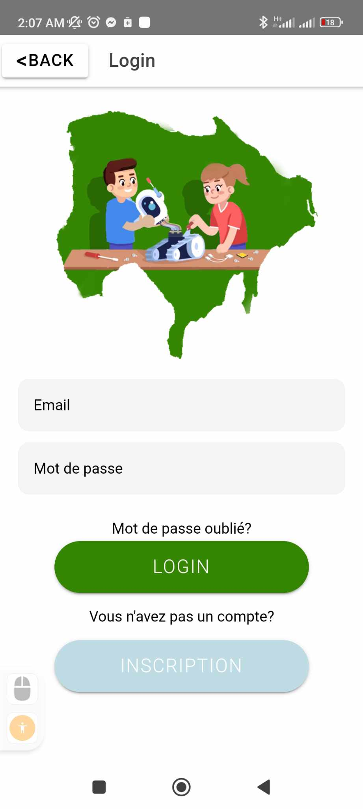
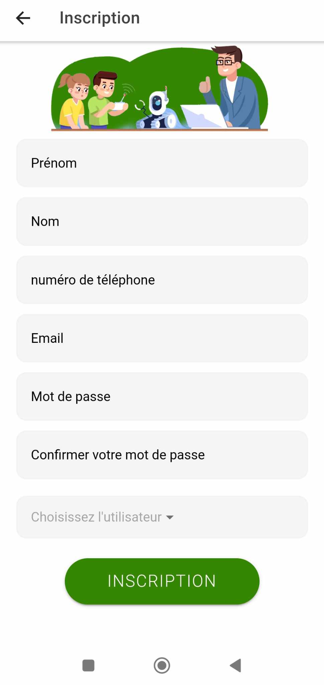
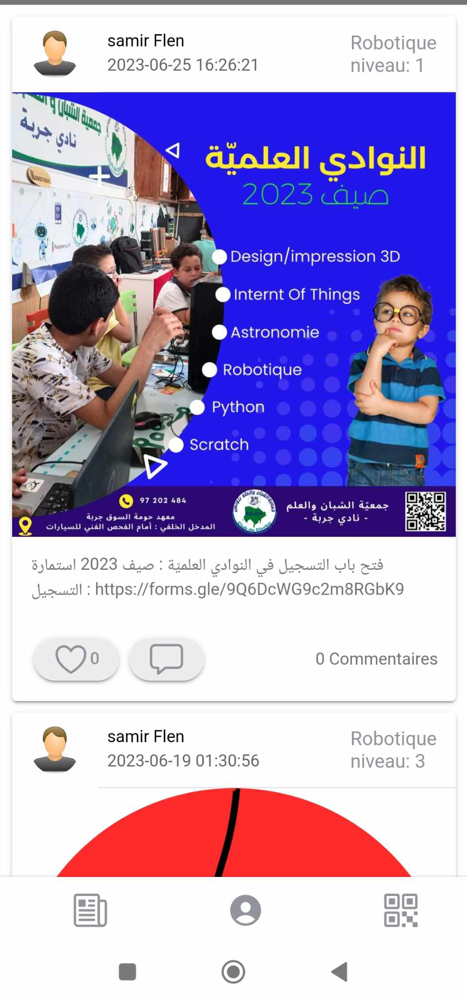
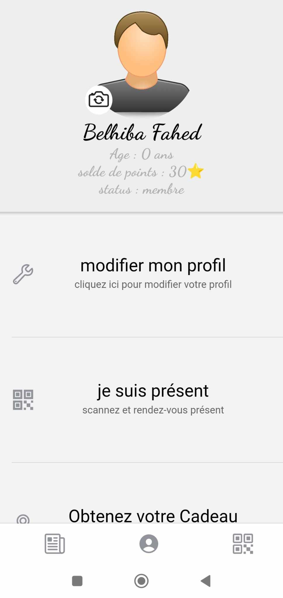

# PFE-Project-App
# PFE-Project-App
an app for association jeunes science Djerba
# YouthScience Management App

## About

The YouthScience Management App is a powerful and user-friendly mobile application developed to cater specifically to the needs of the Youth Science Association. This app empowers young scientists to manage their presence at association events, collaborate on projects, and stay engaged with their community, all within one intuitive platform.

## Features

- **Efficient Attendance Management:** Members can easily check-in to association events and meetings, streamlining attendance management for both organizers and participants.

- **Project Collaboration:** Collaborative projects become seamless with real-time updates, resource sharing, and progress tracking, fostering a culture of innovation and teamwork.

- **Real-time Notifications:** Stay informed and engaged with push notifications and reminders for upcoming events and important announcements.

- **Personalized Member Profiles:** Every member gets a personalized profile to showcase their scientific interests and areas of expertise, facilitating networking and knowledge exchange.

- **Association Updates and News:** Members can stay up-to-date with the latest happenings within the association, celebrating achievements and planning future endeavors.

## Screenshots

## Tech Stack

- Frontend: Ionic Vue.js
- Backend: Laravel
- Database: Mysql

## Credits

The YouthScience Management App was developed by Fahed Belhiba and Samir Temtem
